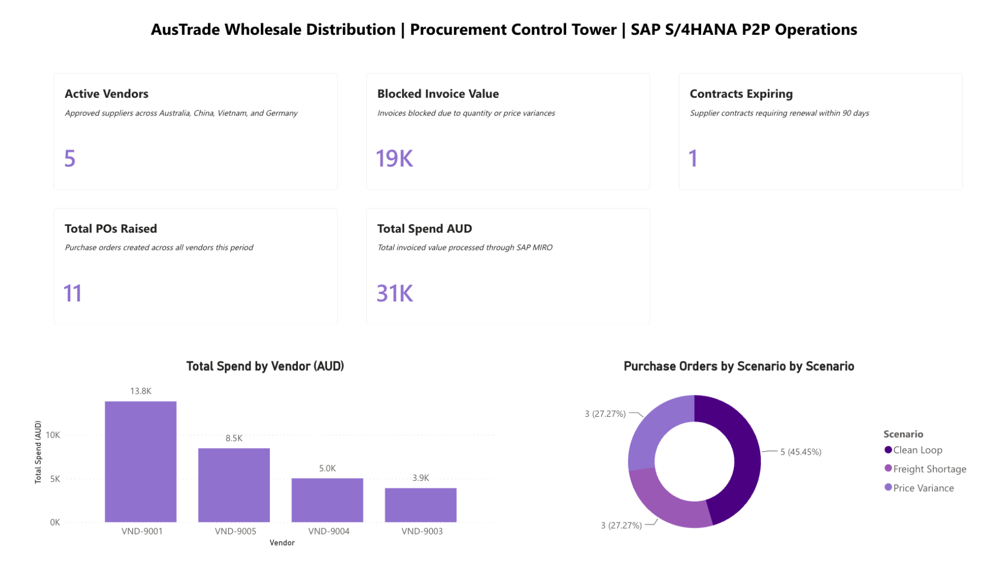
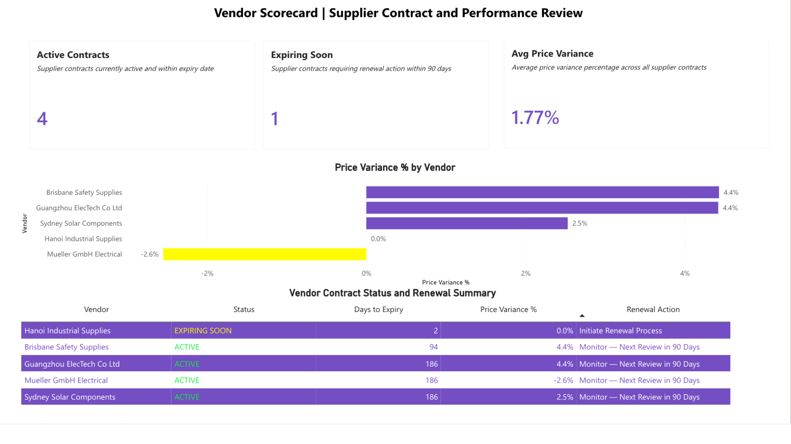

# SAP S/4HANA Procure to Pay Operations Simulation

**A procurement control tower built in Excel and Power BI, modelling the full purchase to pay cycle for a Melbourne wholesale distributor.**

Tools: Microsoft Excel (advanced), Power BI, SAP process modelling
Author: Will Dang | [LinkedIn](#) | [Live dashboard available on request]

---

## Business context

This project simulates the procurement operations of **AusTrade Wholesale Distribution**, a fictional Melbourne based wholesaler supplying electrical, industrial, and safety equipment to construction and manufacturing customers across Victoria. The business sources from suppliers in China, Vietnam, and Germany, and locally within Australia.

The scenario mirrors the daily reality of a purchasing team: raising purchase orders, receiving goods, verifying invoices against orders, monitoring supplier contracts, and reporting spend to management. The project builds the complete procurement data layer, from master data through to transaction processing, three way match compliance, contract monitoring, and an executive dashboard.

It was built to demonstrate practical command of the SAP procure to pay process, spreadsheet fluency, and reporting capability, the core skills Australian employers list for purchasing officer and procurement assistant roles.

---

## The business problems this solves

Purchasing teams lose money and control in four recurring places. This project builds a working solution for each.

| Problem | What the project does about it |
|---|---|
| Invoices paid that do not match the order or the goods received | Automated three way match logic flags every exception before payment |
| Overpaying suppliers on price creep | Price variance detection catches invoices priced above the agreed PO |
| Short deliveries slipping through unnoticed | Quantity variance flagging holds shortages for review |
| Contracts expiring without action | Contract tracker surfaces renewals due within 90 days |

---

## SAP process coverage

The simulation follows the standard SAP procure to pay flow, using the real transaction codes a purchasing officer works with daily:

- **ME21N**: Create Purchase Order
- **MIGO**: Post Goods Receipt
- **MIRO**: Verify and post the supplier Invoice

Three operational scenarios are engineered into the transaction data so the compliance logic has something real to catch:

1. **Clean loop**: Order, receipt, and invoice all agree. Result: CLEARED.
2. **Freight shortage**: Goods received short of the order quantity. Result: BLOCKED for quantity variance.
3. **Price variance**: Invoice priced above the purchase order. Result: BLOCKED for price variance.

---

## Dataset structure

The workbook (`data/SAP_P2P_Simulation.xlsx`) contains eight linked tabs modelling both master data and transactions.

**Master data**
- Material Master (MARA / MARC): 20 materials with ABC classification, safety stock, reorder points, lead times
- Vendor Master (LFA1 / LFM1): 5 suppliers across 4 countries with payment terms and Incoterms
- Purchasing Info Records (EINA): Material to vendor links with lead times and contract dates

**Costing and sourcing**
- Landed Cost and TCO Calculator: Incoterms 2020 (FOB, DDP, CIF), customs duty, and freight across import lanes
- RFQ Evaluation Matrix: Weighted supplier scoring on price, lead time, payment terms, quality, and local versus imported

**Transactions and control**
- Transaction Log (EKKO / EKPO): 33 transaction lines across 11 purchase orders and the three scenarios
- Three Way Matching Compliance Matrix: Automated CLEARED and BLOCKED flagging
- Contract Performance Tracker: 5 supplier contracts with expiry monitoring and renewal actions

---

## Key findings

All figures are outputs of the compliance logic built into the workbook and dashboard.

- **62 percent of invoiced value was held for review.** Of the total invoiced spend, **$19,256 across 6 of 11 purchase orders** failed the three way match and was correctly blocked from payment before release.
- **$1,021 in supplier overcharges was caught before payment.** Price variance detection identified three invoices priced above the agreed purchase order, preventing overpayment.
- **Supplier concentration risk was surfaced.** A single supplier (Guangzhou ElecTech) accounted for **$13,818, or 44 percent of total invoiced spend**, a single source dependency worth flagging to management.
- **One contract required immediate action.** Of five supplier contracts, one (Hanoi Industrial Supplies) was within days of expiry and flagged for renewal, with the remaining four active and monitored.
- **Delivery performance was quantified.** Six purchase orders were delivered more than two days late, averaging 3.5 days of delay, all traceable to the two exception scenarios rather than clean orders.

---

## The Power BI dashboard

A four page procurement control tower reporting on the data above.

1. **Executive Summary**: Spend, active vendors, blocked value, open POs, and contracts expiring, with spend by vendor and orders by scenario

2. **Open PO Tracker**: Delivery performance, exception count, and a detailed list of every delayed order

3. **Three Way Match Exceptions**: Blocked invoice value split by quantity shortage and price variance, with the full blocked PO register

4. **Vendor Scorecard**: Contract status, days to expiry, price variance, and renewal actions for every supplier

---

## Tools used

- **Microsoft Excel**: Master data, transaction modelling, XLOOKUP and IF based three way match logic, landed cost calculation, RFQ scoring
- **Power BI**: Data model, DAX measures, four page interactive dashboard
- **SAP process knowledge**: Procure to pay cycle and transaction codes (ME21N, MIGO, MIRO)

---

## How to navigate this project

- `data/` : The complete Excel workbook, the source of everything
- `dashboard/` : The Power BI file (`procurement_control_tower.pbix`)
- `screenshots/` : Images of all four dashboard pages
- `docs/` : Business scenario, SAP transaction guide, and RFQ template

Start with the Excel workbook to see the data engineering, then open the dashboard screenshots to see the reporting layer.

---

## A note on the data

This is a simulation. The dataset and its scenarios were designed to demonstrate the procure to pay process and the controls that sit around it. The value of the project is in the working logic and the reporting, not in real world savings. It exists to show that I understand how procurement operations run and where the money and the risk actually sit.
